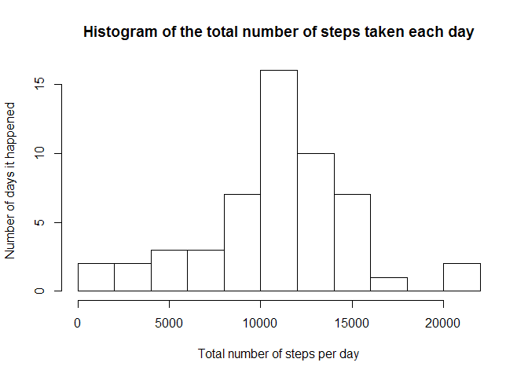
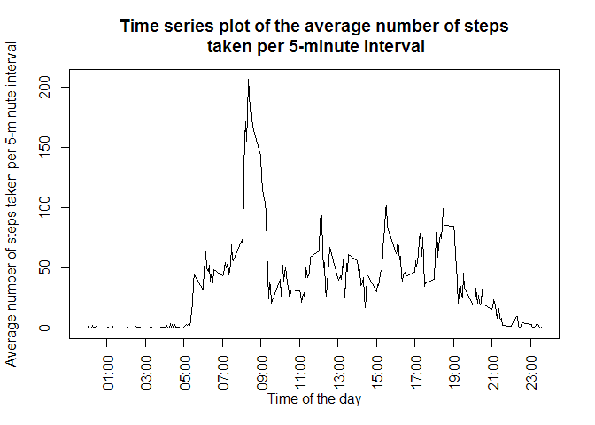
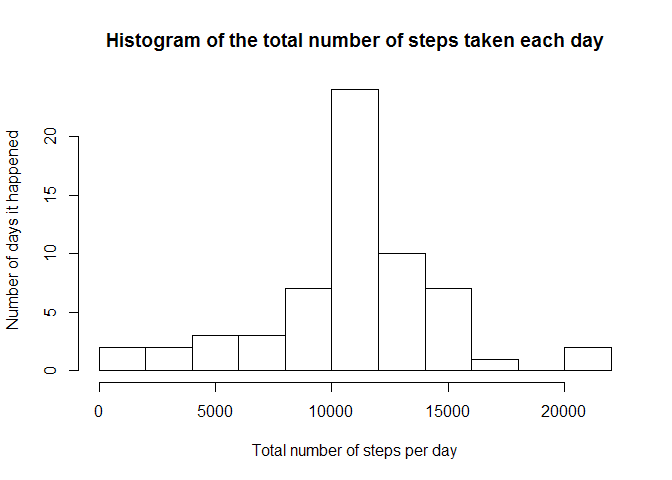
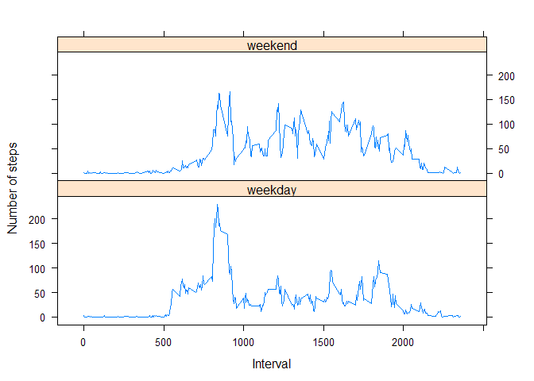

# Reproducible Research: Peer Assessment 1

This page is the result of my work for an assignement on Coursera platform, which you can find on the following link: 
[Reproducible Research on Coursera](https://class.coursera.org/repdata-012/).


## Loading and preprocessing the data

#### Load the data
I first use `read.csv` function to load the data from `activity.csv` file.


```r
data <- read.csv("activity.csv")
```

#### Process the data into a format suitable for your analysis
I then change the format of date column to date format.


```r
data$date <- as.Date(data$date, format = "%Y-%m-%d")
```


## What is mean total number of steps taken per day?
Instructions: *For this part of the assignment, you can ignore the missing values in the dataset.*

#### Calculate the total number of steps taken per day
Total number of steps per day is being calculated with `aggregate` function, and saved into `stepPerDay`.


```r
stepPerDay <- aggregate(steps ~ date, data = data, FUN = sum, na.rm = TRUE) 
```

#### Make a histogram of the total number of steps taken each day


```r
hist(stepPerDay$steps, 
     main = "Histogram of the total number of steps taken each day",
     xlab = "Total number of steps per day", 
     ylab = "Number of days it happened", 
     breaks = 10)
```

 

#### Calculate and report the mean and median of the total number of steps taken per day


```r
meanStepPerDay <- mean(stepPerDay$steps)
```
The **mean** of the total number of steps taken by day is **10766.19 steps per day**.


```r
medianStepPerDay <- median(stepPerDay$steps)
```
The **median** of the total number of steps taken per day is **10765.00 steps per day**. 


## What is the average daily activity pattern?


#### Time series plot
Instructions: *Make a time series plot (i.e. `type = "l"`) of the 5-minute interval (x-axis) and the average number of steps taken, averaged across all days (y-axis)*


```r
stepPerInt <- aggregate(steps ~ interval, data=data, mean, na.rm=TRUE)

plot(x = stepPerInt$interval, 
     y = stepPerInt$steps, 
     main = "Time series plot of the average number of steps\n taken per 5-minute interval",
     xlab = "Time of the day",
     ylab = "Average number of steps taken per 5-minute interval",
     type = "l", 
     xaxt = "n") 

# Both next lines are calculating and drawing X axis labels
xAxisLabels <- paste(substring(sprintf("%04d", stepPerInt$interval), 1, 2), ":", substring(sprintf("%04d", stepPerInt$interval), 3, 4), sep = "")
axis(1, labels = xAxisLabels[seq(13, 288, by = 24)], at = stepPerInt$interval[seq(13, 288, by = 24)], las = 2)
```

 

#### 5-minute interval containing the maximum number of steps
Instructions: *Which 5-minute interval, on average across all the days in the dataset, contains the maximum number of steps?*


```r
stepPerInt[which.max(stepPerInt$steps),]$interval
```

```
## [1] 835
```
The **maximum** is **206.17 steps per 5-minute interval**, which is reached at the **835th interval**. 


## Imputing missing values
Instructions: *Note that there are a number of days/intervals where there are missing values (coded as `NA`). The presence of missing days may introduce bias into some calculations or summaries of the data.*

#### Total number of missing values in the dataset
Instructions: *Calculate and report the total number of missing values in the dataset (i.e. the total number of rows with `NA`s)*


```r
sum(is.na(data$steps))
```

```
## [1] 2304
```
There is a total of **2304 missing values** in the dataset.

#### Strategy for filling in all of the missing values in the dataset
Instructions: *Devise a strategy for filling in all of the missing values in the dataset. The strategy does not need to be sophisticated. For example, you could use the mean/median for that day, or the mean for that 5-minute interval, etc.*

Strategy: I use the **mean for the 5-minute interval** in order to complete the dataset by filling the missing values.

#### Create a new dataset with filled missing values
Instructions: *Create a new dataset that is equal to the original dataset but with the missing data filled in.*


```r
filledData <- merge(data, stepPerInt, by = "interval")
names(filledData) <- c("interval", "steps", "date", "meanStepsPerInt")
filledData$steps[is.na(filledData$steps)] <- filledData$meanStepsPerInt[is.na(filledData$steps)] 
```

#### Histogram of the total number of steps taken each day
Instructions: *Make a histogram of the total number of steps taken each day and Calculate and report the mean and median total number of steps taken per day. Do these values differ from the estimates from the first part of the assignment? What is the impact of imputing missing data on the estimates of the total daily number of steps?*


```r
filledStepPerDay <- aggregate(steps ~ date, data = filledData, FUN = sum) 

hist(filledStepPerDay$steps, 
     main = "Histogram of the total number of steps taken each day",
     xlab = "Total number of steps per day", 
     ylab = "Number of days it happened", 
     breaks = 10)
```

 


```r
meanFilledStepPerDay <- mean(filledStepPerDay$steps)
```
The **mean** of the total number of steps taken by day is **10766.19 steps per day**.


```r
medianFilledStepPerDay <- median(filledStepPerDay$steps)
```
The **median** of the total number of steps taken per day is **10766.19 steps per day**. 

The mean stayed exactly the same, and the median slightly increased from 10765.00 to reach the mean 10766.19. The impact of imputing missing data on the estimates of the total daily number of steps is that the histogram shows that more days are now in the average (the bar in the middle between 10000 and 12000 steps is clearly higher).


## Are there differences in activity patterns between weekdays and weekends?
Instructions: *For this part the `weekdays()` function may be of some help here. Use the dataset with the filled-in missing values for this part.*

#### Discriminating weekday from weekend
Instructions: *Create a new factor variable in the dataset with two levels – “weekday” and “weekend” indicating whether a given date is a weekday or weekend day.*

I use the last dataset to had factor variable (the one with filled missing values).

```r
filledData$weekDay <- as.POSIXlt(filledData$date)$wday
filledData$weekDayFactor <- "weekday"
filledData$weekDayFactor[filledData$weekDay == 0 | filledData$weekDay == 6] <- "weekend"
filledData$weekDayFactor <- as.factor(filledData$weekDayFactor)
```

#### Panel plot
Instructions: *Make a panel plot containing a time series plot (i.e. `type = "l"`) of the 5-minute interval (x-axis) and the average number of steps taken, averaged across all weekday days or weekend days (y-axis). See the README file in the GitHub repository to see an example of what this plot should look like using simulated data.*


```r
filledStepPerInt <- aggregate(filledData$steps, list(filledData$interval, filledData$weekDayFactor), mean, na.rm=TRUE)
names(filledStepPerInt) <- c("interval", "weekDayFactor", "steps")

library(lattice)
xyplot(steps ~ interval | weekDayFactor, data = filledStepPerInt, type = "l", layout = c(1, 2), main = "", xlab = "Interval", ylab = "Number of steps")
```

 


